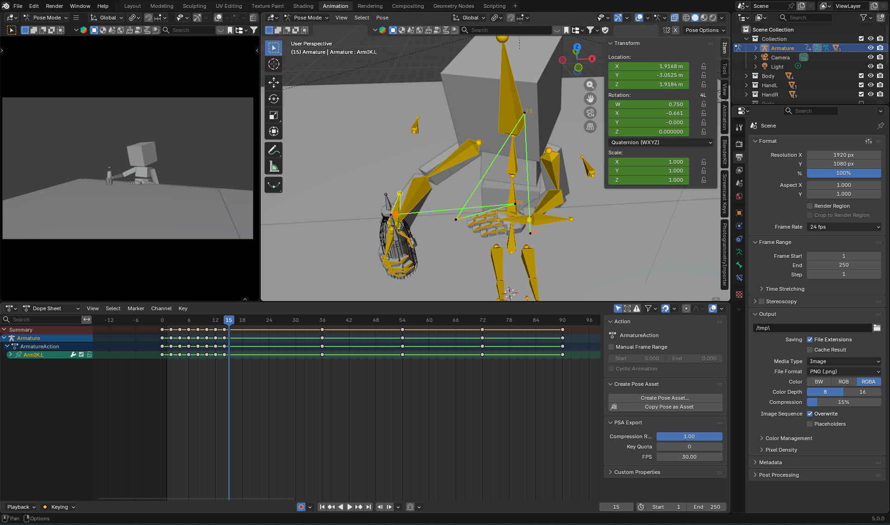

# Starting December 2025
# Development Log

Start Date: December 11, 2025  
---

### Daily Entries

#### December 11, 2025 - Initiation
**Today's Goal:** Environment setup and project planning during limited internet window.

**Progress:**
- Focusing on Bresenham's Line Algorithm 
(https://en.wikipedia.org/wiki/Bresenham%27s_line_algorithm) 
and how it works

**Technical Decisions:**
1. Implementing from scratch in C++ (no graphics libraries)
2. ASCII output first, then OpenGL comparison later
3. Starting with cube (8 vertices, 12 edges)

- Internet access limited to 20-minute windows
- Need to find efficient offline C++ documentation


- The perspective projection formula (x/z, y/z) assumes camera at origin looking along z-axis
- Bresenham's algorithm uses integer arithmetic only - important for optimization

I will finish the rest tomorrow, as it was a late start. Hopefully, I'll discipline myself for at least a month.

#### December 16

Wow, I haven't updated this for a few days. I couldn't get the commit to work because I was too unbothered to figure it out.

- Made Bresenham algorithm work with slopes <= 1 & >= -1.
- Negative values work, but it was mostly easy.
- Tomorrow: ???

#### December 17

I rewrote bresenham's algorithm, with this time knowing how it works. I never thought algebra would actually help me in coding, yet here we are.

For tomorrow, I will try and make a naive version of it working for all sectors.

#### December 19

I forgot to commit yesterday and I'm also one day off every commit. I guess I have to commit earlier than 9pm now. It works for slopes > 1 but not for negative numbers.

#### December 20

I made it work for all degrees. Later, I will try and make a rotating square or cube. Since I already know the matrix multiplications, I figure it probably wouldn't be that hard.

#### December 20 - UPDATE

Okay, it's hard. Probably because of my trash math skills and whatsoever, but I'm going to save this for tomorrow. I'll probably try and rewrite the rotation matrix or create a new function for it. It doesn't seem like gitignore is not working, but I'm stupid, so I probably did something wrong.
##### Update 2

Yeah, I did something wrong.

#### December 21

Finally! There is now a rotating cube on the screen. Now that I look at the square, it doesn't seem symmetrical. I will try to fix this.

#### December 24

It's been 2 days, but I'm moving to SDL3. I am also reimplementing it again to drill the algorithm in my head. Also, it turns out the reason why the square didn't seem symmetrical was because I divided the values then turned the float into an integer, which messed up the values. I probably won't do that again.

#### December 25

I have successfully imported the files into SDL2. I also created a class and header file for line handling. I don't know what I could do next. 
My next choices that I would like to do:
1. Raytracing
2. Triangle filling (I should probably do this)
3. OpenGL to Vulkan
4. Physics Engine

All of these are quite difficult but it seems kinda fun (not opengl though) So I'll probably learn how to fill out triangles.

On a side note, I also need to finish my rig in Blender so I can animate easier.

#### December 26

```cccj3.cpp```

I'm trying to get colour interpolation to work so I can use the colours to make it look smoother, like in OpenGL. Also, I added a Dmoj page with some answers there, and currently I'm failing and I'm getting AC up till the 13th case. I want to try and do all Junior division questions before hitting Grade 9.

#### December 27
Well... I kinda am getting sidetracked over me trying to learn XML and Lua for a niche rhythm game called NotITG. I know my friends are gonna see this and will say something like "of course you were" and stuff. To other people, you should really check it out, because in my opinion, it's really cool and barely anybody plays it for such a visually appealling game. Not in UI terms, but the levels itself.

#### December 31

Oh my god... I got even more sidetracked over studying raytracing and simple arduino. I gotta lock in on the triangle.

#### 2026

#### January 2

Wow, it seems I messed up the code. I need to rewrite the SDL3 pixel drawing. I will need to dig deeper on how my previous code worked.

#### January 6

It's been 4 days... and I still can't get this trangle rasterization to work. I'm still going to work on this, as I did for every single day... I guess I'll finally push this in probably more than a week.

#### January 12

I've fixed it! It's been way too long and I basically failed on my discipline. I had forgotten an = sign for a loop and now it works. I forgot to account the fact that all the pixels that are going to make the line are in the bounding box's edge, which I forgot to tell the program to check as well. I can't believe a 2 week long bugtesting phase was because of this.

#### January 20

```cccj4.cpp```

I did a DMOJ today, and AC'd my first junior 4. I just want to try and complete CCC Juniors before Grade 9, so I can prepare for Senior. I've heard the difficulty gets harder and harder. It took around an hour to do my junior 4, so I guess practice is something I need to do more often. Also, I have a schedule now, so hopefully no more super long in-between logs. On a topic of my rasterizer, I'm trying to learn how to rasterize a gradient triangle, which is the next part of *Graphics Programming from Scratch*, by Gabriel Gambetta. 

#### January 22

```ccc2010j4.cpp```

Ohhhh my god, I got absolutely demolished with vectors. I'm going to work on J4 2010 tomorrow. This should NOT have taken this long.

#### January 23

```ccc2010j4.cpp```

Got it done. I think I need to get better at my array and vector skills.

#### January 27

```ccc2007j4.cpp```

Did an easy question today. Mainly had to focus on schoolwork this weekend.

#### January 29

```cccs2.cpp```

Did another easy question. Thank you, algorithm library.

#### January 30

```ccc00s2.cpp```

Wow! A new type of question! So, it was a simulation type one. I found it much easier to do things when I write down the basic ideas of the stuff, so I'm going to do that from now on. I also have done my first weighted 100% 7pp question! The second 7p was the one yesterday, but it was so freaking easy.

#### February 1

```ccc96s2.cpp```

An annoying one. Whitespaces were not specified on the question well.

#### February 6

```ccc18j5.cpp```

I got stuck on a J5. I'd never done graph theory, so it was difficult for me.

#### February 11

I moved to OpenGL graphics programming, and I got a triangle set up in a few days because I was dragging it a bit. I already know some of this stuff, like VAOs and VBOs and GLSL and stuff like that, and I just have to reimplement it.

#### February 20

I did a bunch of stuff, all the way to Texturing. I also created a seperate header for shading and stuff.

#### March 20

Sorry I haven't commited for some time. I kinda burned out a little and took a little break, and I also just keep on forgetting to commit. I now how have a rotating cube, which is pretty cool. 

#### March 22

I've decided on making a second project like a game, since I heard that having 2 or 3 projects can help space and clear out your mind if you're stuck on one project.

#### March 23

I've revisited the fundamentals of OpenGL, basically trying to memorize the boilerplate and how it works.

#### March 28

I finished the first chapter of LearnOpenGL and learned about static libraries. Now, I know how to actually make a release build.

#### April 3-8

So, I've gotten some work done. I got specular and Phong to work, so that's pretty cool. Things are starting to look better.

#### April 9

Uhhh... I had some free time today and decided to work on this a bit more. I got to specular reflections! Outcomes are starting to feel more rewarding.

#### April 11 - 12

I got different types of lights to work. I tried normal shading but didn't account for the face normals, so I'll put it off for now.

#### April 18 - 20

I'm trying to clean up my code so I don't feel lost when I go through the files. I think doing this will further strengthen my understanding of each component. I also am going to add some RAII wrappers just as a good practice.

#### April 21 - 22

I have created some broken code. I worked for about 4 hours so I think it'll be enough for now. I'll rewrite the code tomorrow.

#### April 24

I've created the library for vertex buffering. The bug took me too long to fix but now it's done.

#### April 25

I've created the library for textures now, along with adding some fps indicators and movement fixes.

#### April 26
I don't think I did much today, but I'm going to make a library that can create lights.

#### April 27
I didn't do much work today, but I'm still thinking of some ideas.

#### April 28
Finished, don't have much time to do it since my computer shuts down at 10 now.

#### April 29

Well, that's strange. The FPS counter that updates every second is somehow activating the third element in my keymap array, making the camera move in the left axis for 1 frame. What did I do in the memory?

UPDATE:
Wow, I'm so smart. Why did I think that variables would initialize to something? I kept the garbage values that were probably used by the stringstream operation, and thought array element 3 was true.

UPDATE 2:
I added some more stuff and I think I'm finally finished cleaning up the code. I'll continue assimp tomorrow.


#### April 30

I added the Mesh class. I can't work much today, because I need to study for a test and also do some school projects.

#### May 1

I added the Model class. I'll dive deeper into its meaning tomorrow and implement the obj actually load, along with adding my own libraries to the files.

#### May 2

Understood a bit more about the assimp library. I couldn't work today, since I've been outside for almost the entire day today.

#### May 4

Ughhh... I hate the new restriction. I keep on getting cut off on my work time. It's still broken.

#### May 5

Yes! It finally worked! I was using &vertices and &indices instead of the actual .data(). Finally... I also almost completely understand how Assimp works and what are inside the files.

#### May 6

Now that I'm apparently doing "Advanced OpenGL", I'm going to start writing down the concepts of them in here. I also added MSAA to the rendering, but nothing special.

Oh yeah, I think I'm gonna make Releases of the certain things I'm proud of. I think I'm gonna start with the already made .zip files I made before. I'm also gonna make one for the custom model loader.

##### Depth Testing
If you don't remember, there we a ```glEnableDepth()``` function in setup that correctly layers objects in the z-axis. It's like putting sheets of paper in an order that actually makes sense. You also need to clear the Depth buffer every frame with ```glClear()```. 

Okay, so technically, it checks every fragment given to the function and it passes based on the inequality it has with a certain depth value. 
In special cases, you want to disable editing the depth buffer and basically lock the layers in place even though if they move. That function will be called ```glDepthMask()``` and setting it to ```GL_FALSE``` will make the buffer unwritable. 

You can also use functions to edit the inequality of the Depth Test, which is edited by the function ```glDepthFunc()```.

A list of all the enumerations it can take as an argument:
- `GL_ALWAYS`: Always will pass the depth test, layers will be in the order it was rendered in pipeline (I think)
- `GL_NEVER`: Never passes the depth test, nothing will show up 
- `GL_EQUAL`: Only passes if the fragment depth is exactly the depth value
- `GL_NOTEQUAL`: Only passes if the fragment depth isn't the depth value
- `GL_LESS`: Only passes if the fragment depth is less than the depth value. This is the default that lets you see the "normal" rendering.
- `GL_LEQUAL`: Only passes if the fragment depth is less than or equal to the depth value
- `GL_GREATER`: Only passes if the fragment depth is greater than the depth value
- `GL_GEQUAL`: Only passes if the fragment depth is greater than or equal to the depth value

Now, there is another question. How does the buffer store the distances? It can't just store the actual data, which could go into very far. It would have to use larger byte sizes for a single pixel, in which there are normally 1920x1080 in size, which is a crazy amount of pixels. So, instead, computers input the float between 0 - 1 that is tells you the percentage of how close it is to the far face of your projection frustum (your camera). For example:

If the near frustum is 0m and the far frustum is 1 km, and the pixel is 600 m away from the camera, then the value stored will be 0.6. However, without some optimizations, turning the distance into a float is almost useless. Now, the solution is to think of it like an LOD optimization. The farther something is, the less detail it needs to have. This creates a ```log()``` type function, where the farther it is, the less it travels each distance step. I don't really know how to explain this, but at least I understand now.

#### May 7

I understood most of stencil testing but I haven't implemented stuff myself yet. I just wanted to rewrite this in my own words for now, and implement tomorrow.

##### Stencil Testing
Stencil testing is basically when you apply a mask over your render, like a stencil (Hence the name) and was made to basically be able to use multiples renders and stack them on top of each other and cut bits off for each layer. It's used for things like shadows and outline rendering.
Of course, you enable it with ```glEnable(GL_STENCIL_TEST)``` and clear the buffer every loop. You can control the strength of the stencil writing with the ```glStencilMask()``` and with a hexadecimal argument.

And, of course, there's a ```glStencilFunc``` that behaves just like ```glDepthFunc()```, except for a few more arguments it can take. It has the regular inequalities that you should probably already know, but now you get to control the number it compares it to and the transparency of the mask (which is just the ```glStencilMask()``` function). This leaves the function with arguments ```glDepthFunc(GLenum func, int ref, unsigned int mask)```.

However, ```glDepthFunc()``` doesn't do anything on its own, but just decides whether a fragment fails or passes. Instead, that choice is given to ```glStencilOp()```. It contains 3 ```GLenum``` arguments: `sfail`, `dpfail`, and `dppass`. `sfail` is when the stencil fails. `dpfail` is when the depth fails but the stencil passes (Although the variable name just states the depth fails, you should assume the stencil passes), and `dppass` means both buffers pass. 

Below are all the enums that are valid in these arguments:
- `GL_KEEP`: Keeps the value as is.
- `GL_ZERO`: Sets the value to 0 (transparent).
- `GL_REPLACE`: Replaces the value to the reference value (or the `ref` variable) given by the ```glDepthFunc()```
- `GL_INVERT`: Inverts the value.
- `GL_INCR`: Increments the value by 1 unless it's already fully saturated.
- `GL_INCR_WRAP`: Does the same thing as `GL_INCR` but instead of not doing anything when fully saturated, you loop around like the modulo function, so it becomes 0.
- `GL_DECR`: Decrements the value by 1 unless it's already 0.
- `GL_DECR_WRAP`: Does the same thing as `GL_DECR` but instead of not doing anything when 0, you loop around like the modulo function, so it becomes the highest saturation.

#### May 8

I didn't do much today. I had class and extracurriculars, so I only implemented the stencil outline.

#### May 9

I went to the mall today to get stuff and had class today, but I did read about colour blending and I think I understand it mostly. I'll write about it tomorrow (if I have time).

#### May 10

So... I've broken something and I keep on getting Error 1282. I don't know where it happens but I've been debugging it for almost 2 hours now, so I think I'll continue tomorrow.

#### May 11

I made another dumb mistake. I forgot to add the .glsl extension to the `vertStencil.glsl` argument. Now, I think the texture handler isn't correctly handling the .png file, so it's not rendering correctly.

#### May 12

Another dumb mistake. I made attribute 1 for the VAO start reading from the Z axis instead of the S axis for textures. Now it works.

#### May 13

Finally! I finished the Blending chapter and I can now move on.

##### Blending

Blending is basically what will happen when you put a semi-transparent colour `( 0 > .a < 1 )` and finding the colour that it creates. It does it by combining the colours like overriding the colour behind with a percentage. Think of the alpha being a percentage instead of a float (eg. 0.34 = 34%).

The formula for this is:
$C_1$: Colour in front of the affected object (always semi-transparent)
$A_1$: Alpha of $C_1$
$C_2$: Colour of the affected object
$A_2$: Alpha of $C_2$

$$(C_1 \cdot A_1)+ (C_2 \cdot (1 - A_1))$$

For example, take a front value `vec4(1.0, 0.2, 0.0, 0.3)` and a back value `vec4(0.3, 1.0, 1.0, 0.7)`. You would calculate the following:
$$ \begin{pmatrix} 1 \\ 0.2 \\ 0 \\ 0.3 \end{pmatrix} \cdot 0.3 + \begin{pmatrix} 0.3 \\ 1 \\ 1 \\ 0.7 \end{pmatrix} \cdot (1-0.3) = \begin{pmatrix} 0.3 \\ 0.06 \\ 0 \\ 0.09 \end{pmatrix}+\begin{pmatrix} 0.21 \\ 0.7 \\ 0.7 \\ 0.49 \end{pmatrix} = \begin{pmatrix} 0.51 \\ 0.76 \\ 0.7 \\ 0.58 \end{pmatrix}$$

There is also another function that determines the alpha of both the source and the destination vectors. It's called `glBlendFunc(GLenum sfactor, GLenum dfactor)`, and for each argument, you specify what you're going to use as the alphas.

Notice how the multipler is always the alpha of the source ($0.3$) and the rest of the percentage ($1 - 0.3 = 0.7$). How do you usually put in as the arguments `sfactor` and `dfactor`? Well, you may notice that the source alpha is the same, but the destination alpha is dependant on the source's. This means that you would put `GL_SRC_ALPHA` and `GL_ONE_MINUS_SRC_ALPHA` as them respectively. 

Here is a list of enumerations you can put as an argument for these:

- `GL_ZERO`: Sets to zero
- `GL_ONE`: Sets to one
- `GL_SRC_COLOR`: Sets to source colour
- `GL_ONE_MINUS_SRC_COLOR`: Sets to the leftover percentage of source colour
- `GL_DST_COLOR`: Sets to destination colour
- `GL_ONE_MINUS_DST_COLOR`: Sets to the leftover percentage of destination colour
- `GL_SRC_ALPHA`: Sets to source alpha
- `GL_ONE_MINUS_SRC_ALPHA`: Sets to the leftover percentage of source alpha
- `GL_DST_ALPHA`: Sets to destination alpha
- `GL_ONE_MINUS_DST_ALPHA`: Sets to the leftover percentage of destination alpha
- `GL_CONSTANT_COLOR`: Sets to the constant colour
- `GL_ONE_MINUS_CONSTANT_COLOR`: Sets to the leftover percentage of constant colour
- `GL_CONSTANT_ALPHA`: Sets to the constant alpha
- `GL_ONE_MINUS_CONSTANT_ALPHA`: Sets to the leftover percentage of constant alpha

The constant colour is defined by `glBlendColor()`.
You can individually affect the colour with `glBlendFuncSeparate()`.

Also, it doesn't work if you don't render things from closest to farthest.

#### May 14

Awesome. Yet another bug. The UVs that were generated by Assimp are wrong for some reason and I have to search through the code.

#### May 15

The problem was that I deleted `stbi_set_flip_vertically_on_load(true);` and caused all texture to load upside down. Now, I don't know if it's intentional or not, but face culling isn't working and is just showing black faces (which I'm assuming is the clockwise faces) for front faces that should be deleted.

#### May 16

I wasn't able to work today. I went to Toronto and I then had to do a 2 hour class right afterward, which ended at around 9 PM.

#### May 17

Oh... So it did work, but the lighting normals were flipped backwards too which rendered everything black. I had to remove lighting calculations for it to work.

##### Face culling

Face culling is a basic optimization technique that only renders triangles that are facing towards the camera.

How face culling basically works is that OpenGL culls a large amount of faces to keep based on which direction it's facing towards the camera and removes the rest. 

However, OpenGL doesn't know whether a face is facing towards us or not. We can tell it that by just stating the order it renders the points on a triangle. This is because you know that no matter what if you choose random points of a triangle, the order always shows a pattern of rotation. Along with that, if it was facing the opposite way, it would also render the points backwards (for example, clockwise to counter-clockwise). This is how we can state the direction a triangle is without having to make expensive calculations.  

For example, you could tell OpenGL that a "front facing" face is when the vertices are winded counter-clockwise, and then tell it to remove the faces that are facing front of the camera. This removes all front faces and only renders the faces facing away.

In code, you enable face culling with `GL_CULL_FACE` and `glEnable()`, like usual. Then, you specify what a front facing triangle's winding order is with `glFrontFace()`, in which the argument is either `GL_CW` (clockwise) or `GL_CCW` (counter-clockwise). Finally, you tell OpenGL to cull either the front-facing triangles or the back-facing ones with `glCullFace()`, in which its argument is either `GL_FRONT` or `GL_BACK`.

#### May 18

Wooahh! I implemented framebuffers and created a glitch effect & a Depth of Field effect! I spent a lot of time doing this today, taking about 4 or 5 hours, but I think it's worth it! Shaders are so cool. I'll explain framebuffers tomorrow.

#### May 19

Uhhh... I'll continue tomorrow. I didn't get much time today.

##### Framebuffers

Framebuffers are buffers that store all information and buffers about a single frame, like the colour, depth, and stencil buffer. Currently, we use the default framebuffer, in which its ID is 0. OpenGL allows us to create our own framebuffers, making it more flexible and allows us to do stuff like shaders (eg. Glitching, static, vignette, and blurring).

Creating a framebuffer is pretty straightfoward. First, you generate it with `GLuint fbo;` and `glGenFramebuffers(1, &fbo);`. It's pretty much the same as any other buffer. Then, you bind it as the current state with `glBindFramebuffer()`, where its first argument is how the actions after are going to affect the framebuffer. `GL_FRAMEBUFFER` means it can both read and write to the framebuffer, `GL_READ_FRAMEBUFFER` means it can only read from it and cannot write to it, like using function `glDrawArrays()` isn't useable. `GL_DRAW_FRAMEBUFFER` means it can only write to the framebuffer, but not read from it.

Continuing, there are some requirements for a framebuffer to be useable. At least one of the following need to be fufilled:
- At least one buffer needs to be attached (colour, depth, or stencil)
- There should be at least one colour attachment
- All attachments should be complete as well (reserved memory)
- Each buffer should have the same number of samples (For MSAA)
Attachments are either textures, or a Renderbuffer, which I'll explain later.
You should note that anti-aliasing doesn't affect framebuffers unless you tell it to, so just enabling MSAA now won't work.

Once you get one of those attached, you can check whether the buffer is ready by using the function `glCheckFramebufferStatus()` and if it returns `GL_FRAMEBUFFER_COMPLETE`, then it's finished. You should also probably know you need to delete the framebuffer once done with use or destruction via `glDeleteFramebuffers()`, like anything else.

Now, how do you attach something to it? First, I'll explain how to attach a texture. There really isn't much difference than normally making one, except in `glTexImage2D()`, you set the dimensions as the width and height of the screen and the data as `NULL`. Setting data to `NULL` just means no data is automatically written to it, and only memory is allocated for it. Everything else is basically the same.

Once you have your texture ready for use, you bind it to the framebuffer with `glFramebufferTexture2D(GLenum target, GLenum attachment, GLenum textarget, GLuint *texture, int level)`. Its parameters are:
- target: the framebuffer type we're targeting (draw, read or both)
- attachment: the type of attachment we're going to attach
- textarget: the format of the texture that's going to be attached
- texture: The actual texture to attach
- level: Mipmap level of the texture

Keep in mind this is only for texture attachments. For the other type of attachment, it's called a render buffer.

Renderbuffers are attachments that were added as another option other than textures that actually held buffers. OpenGL can do some optimizations that gives an edge to normal textures. However, the disadvantage to this is that it cannot be read directly. You could read it via a slow function called `glReadPixels()`, however.

Creating a renderbuffer is pretty straightforward. First, you generate the buffer with `glGenRenderbuffers()`. Then, you go configure the renderbuffer with the stuff it holds, like depth and stencil buffers.

How do you configure the renderbuffer, however?

First, you just bind it to the current state with `glBindRenderbuffer()`.

Second, you give it storage for it to put stuff in with `glRenderbufferStorage(GLenum target, GLenum internalformat, GLsizei width, GLsizei height)`. The `target` for us is what it gets to do with the framebuffer. `internalformat` is the format that OpenGL will use to read and write the information. For example, a format could be the depth buffer, the stencil buffer, or both. (A renderbuffer can be both a stencil and a depth buffer, giving depth 24 bits of info and stencil 8 bits. ) Then, it's the `width` and `height`, which is pretty self-explanatory. It determines the width and height of the buffer(s) it will store.

Third, we actually attach the renderbuffer to the framebuffer with `glFramebufferRenderbuffer()`, which you see is almost the same name as `glFramebufferTexture2D()`.
The arguments for this function is `glFramebufferRenderbuffer(GLenum target, GLenum attachment, GLenum renderbuffertarget, GLuint renderbuffer)`. `target` is the same thing as before, `attachment` is the internal format of the renderbuffer, `renderbuffertarget` is a lot like `target`. It tells OpenGL what it can do to the renderbuffer. Finally, `renderbuffer` is just the ID of the actual renderbuffer.

Now that you know how framebuffers get set up, how do they get used? First, you need a shader that is the same as a simple texture rasterizer. You also need vertices that form a rectangle covering the entire screen.

What you basically do is that you render everything on our own framebuffer instead of the default, which allows us to edit it with shaders. To do that, you bind the framebuffer with `glBindFramebuffer()`. Everything else goes like normal. Then, once you're done with everything, you bind the framebuffer back to default (`0`). Then, you use your screen shader and bind the vertex array. *Remember to disable `GL_DEPTH_TEST` if you do have it enabled.* Also remember to clear buffers. Then, just bind the texture and draw the arrays/elements.

#### May 20

I finished explaining framebuffers. I don't thnk it was very well explained, mind you, but I think it's fine. Also, it seems like I forgot to finish the commit. I just pressed "Commit & Push" and just left it there. I've already done that before.

#### May 21

I did cubemaps. It took almost 2 hours, but now I'm on writing the explanation. I'll leave the rest for tomorrow.

##### Cubemaps

Cubemaps are essentially used for skyboxes and is basically their entire use. It helps other objects create reflections and refractions that are much simpler than finding reflections object-to-object, so it's more cost-effective than the complex formulae that you have to use otherwise.

In order to create a cubemap sample (`samplerCube`), it's about the same as a `sampler2D` except you pass 6 textures instead of just one - one for each face. 

First, you generate the texture with `glGenTextures(1, &cubemap)`.

Then, you bind it with `glBindTexture(GL_TEXTURE_CUBEMAP, cubemap)`. This tells OpenGL that it needs to write to the texture like a cubemap and it's also in our current state.
Then, you start binding each texture with `glTexImage2D()`. However, instead of `GL_TEXTURE_2D`, you give it 1 of the six faces to write to.

You just do the regular thing per side, and each enumeration (From lowest hex definition to highest) is the following:

1. `GL_TEXTURE_CUBE_MAP_POSITIVE_X`: Right
2. `GL_TEXTURE_CUBE_MAP_NEGATIVE_X`: Left
3. `GL_TEXTURE_CUBE_MAP_POSITIVE_Y`: Top
4. `GL_TEXTURE_CUBE_MAP_NEGATIVE_Y`: Bottom
5. `GL_TEXTURE_CUBE_MAP_NEGATIVE_Z`: Front
6. `GL_TEXTURE_CUBE_MAP_POSITIVE_Z`: Back

Since each definition is just `GL_TEXTURE_CUBE_MAP_POSITIVE_X` + an offset, you can just create a loop that goes through each one without you having to manually write it.

In the GLSL code, you need to make a new seperate shader that draws before everything. The vertex shader is basically the same, except for the fact that it doesn't need to take the camera position matrix anymore, since it's a skybox. You also need to add a uniform, like `uniform samplerCube skybox`. You can just use `texture()` like a regular texture.

Now, in the actual loop, you bind the texture with `glBindTexture(GL_TEXTURE_CUBEMAP, cubemap)`, and set the uniform to whatever texture ID you set the cubemap to. Then, you just draw the vertex array (which is a cube), and now it's done.

#### May 22

I did some Blender stuff today for about 2 hours, so I didn't get much work done. Should I add my Blender files here too? 

#### May 23

I made a really cool first part of my animation. Sadly, just blocking it out took around 2 hours and making the first second took another 1 hour. I don't know if that's normal, but at least I'm learning.

Also, I finished my cubemap stuff. I'm going to add more later today, hopefully. However, I do have a school project to do, so maybe not.

##### UPADATE

Hey! My animation actually looks decent! I'm proud of it. It took up almost 5 hours today, but it's fine for the 8 seconds I made.

#### May 24

I wrote some stuff. I totally didn't finish 4 minutes before my time ran out.

##### More about buffers and GPU VRAM

There are some more ways to use and write to buffers. For example, you could just write to a single part of a buffer or even acquire a buffer directly from the VRAM (The GPU RAM), giving it the benefit to be able to perform C-style function on it like `memcpy()`.

###### `glBufferSubData()`

`glBufferSubData()` is when you only write data to a smaller chunk of memory into the buffer, and not the whole thing. For example, you want to replace a single vertex, but you have to replace the entire buffer to do so. That would cost a lot of performance. That is where `glBufferSubData()` comes in. It only replaces the parts that need to replace and nothing more.

A requirement for `glBufferSubData()` to run is that the memory needs to be properly initialized, like with `glBufferData()`.

The arguments of `glBufferSubData()` is almost exactly the same as `glBufferData()` except for the fact that it requires the starting point (in bytes). All the arguments are `glBufferSubData(GLenum target, GLintptr offset, GLsizeiptr size, const GLvoid *data)`.

###### Mapping Buffers

Buffers are pieces of data inside a GPU. Normally, you aren't able to access it normally, like with normal C functions, but if you get its address from a pointer, you could do it. This is where the function `glMapBuffer()` comes in. It directly takes the address of the buffer and lets you use C-style functions on it, like `memcpy()`. The parameters for `glMapBuffer()` are the target `GLenum` and how it's able to be accessed (`GL_WRITE_ONLY`, `GL_READ_ONLY`, `GL_READ_WRITE`). Once you're done with your stuff, you use `glUnmapBuffer(GLenum target)`.

###### Copying Buffers

In order to deep-transfer (Move info without the same addresses) information for buffers, you first need to go through the CPU, then go back to the GPU. This is very costly in performance, which is why `glCopyBufferSubData()` exists. You may be wondering why it's a `Sub`. This is because sometimes you just want to copy part of the buffer, and if you were actually trying to copy the entire thing, GLAD has an edge case for that, in which it will do optimizations so there is no need for just a regular `glCopyBufferData()` without the `Sub`. Its parameters are `glCopyBufferData(GLenum readtarget, GLenum writetarget, GLintptr readoffset, GLintptr writeoffset, GLsizeiptr size)`. `readtarget` and `writetarget` are the targets of the input and the output respectively, like `GL_ARRAY_BUFFER` as the input and `GL_COPY_WRITE_BUFFER` as the output. The `readoffset` and `writeoffset` are the offsets (in bytes) on where it should read and write. Lastly, `size` just defines the range it reads from and how much input it takes in.

#### May 25

I added some stuff, but not as much as I wanted to.

##### More about GLSL inputs & outputs

###### Vertex Shader

- `out highp float gl_PointSize`
In your code, you can set the rendering presets to render something else entirely. We've seen this before, where we, instead of draw polygons, we drew wireframely. We can also draw things in points. `glEnable(GL_PROGRAM_POINT_SIZE)` allows us to do exactly that, and `gl_PointSize` helps OpenGL define the size of the point. The colour of the point is based on the colour that the fragment shader gives.
- `in highp int gl_VertexID`
`gl_VertexID` shows the ID of the vertex, and is a read only variable. The ID depends on how you draw the buffer, for example, via `glDrawArrays()` or `glDrawElements()`. With `glDrawArrays()`, it just tells you the order its been rendered, from 0 to whatever number. For example, if a point was the 60th point rendered, its ID would be 59 (Since it starts at 0 and not 1). With `glDrawElements()`, it tells you the index its been rendered. For example, if your point was in the 4th index in your EBO, then the ID would be 3.

###### Fragment Shaders

- `in highp vec4 gl_FragCoord`
As you can tell, `gl_FragCoord` are the coordinates of the fragment in 3D space. This includes .x and .y, but also .z (The depth value) and .w (The value for perspective). It's a read-only variable. The units of x and y are in pixel form, like which pixel it is in terms of difference in X and in difference in Y.
- `in bool gl_FrontFacing`
This is another pretty self-explanatory one. It tells you whether a face is front-facing or not. Something is considered "front-facing" whether the winding order is clockwise or counter-clockwise. The default is counter-clockwise, but you can define it with `glFrontFace()`, as previously talked about before.
- `out highp float gl_FragDepth`
This output variable is just the same as `gl_FragCoord.z`, but you can actually write to it. However, since this is processsed in the fragment shader and not the vertex shader, it's slower and OpenGL has to wait until the shader finishes to render the pixel. 
Because of this overhead, **in minimum version OpenGL 4.2**, Khronos added an optional specification in the initialization, like: `layout (depth_\<condition\>)` at the start. This allows OpenGL to do something called "Early depth testing", an optimization technique that makes depth tests faster. The condition part can either be 4 things:
    - `any`: The change will vary either greater, less, or equal to `gl_Position.z`. Depth is unpredictable and early depth test does not happen.
    - `greater`: The change will be greater than `gl_Position.z`. This tells OpenGL that if the early depth test fails, then the fragment depth test would too, so it's safe to discard it.
    - `less`: The change will be smaller than `gl_Position.z`. This tells OpenGL that if the early depth test succeeds, then the fragment depth test would too, so it's safe to keep it.
    - `unchanged`: The change will not differ from `gl_Position.z` and early depth test _will_ be the final test.

###### Interface blocks
Interface blocks are like namespaces that put your input/output variables in classes. This is important for readability and organization. For example, a `out vec2 TexCoords` would be in the `vs_out` interface block. Usually, an interface block usually looks like this:
```
out VS_OUT
{
    vec2 TexCoords;
} vs_out;
```
The first line, which is called the "Block name" is the name that OpenGL looks for when it sends/takes the information. It's basically the ID to destinguish itself from the same name, along with the fact that the name on the bottom is able to be switched out per shader file. 
For example, `out VS_OUT {} vs_out` and `in FS_OUT {} vs_out` are not the same.
However, `out VS_OUT {} vs_out` and `in VS_OUT {} fs_cout` are.
The scope in the middle just declare the variables. No need for `out`, `in`, or `uniform`, since the top already defines it.
The bottom is the "instance name" of the interface. It can vary between shaders, being named over whichever makes sense. 

###### Uniform Buffer Objects

Whenever you pass data for a uniform variable, there is some overhead where bringing the information happens. Uniform buffer objects solve that problem. The data is always binded with the shader, and you're able to change the information inside it only in chunks and don't have to change the entire thing. 

The first thing you do to make a UBO is to just normally set up the buffer with `GL_UNIFORM_BUFFER`. Then, you allocate the memory needed for the UBO (in which you will have to calculate yourself or using `sizeof()`).

However, there are most likely multiple uniforms in your shader code, so how does OpenGL know which buffer goes to which uniform interface block? This is done by something called binding points. Think of it like an ID the UBO holds in which the code will use to connect. That is done by `glBindBufferBase(GLenum target, GLuint index, GLuint buffer)`. 
(On a side note, you are also able to seperately bind parts of a single UBO, like for the first 60 bytes, it binds to point 0, but for the rest, it binds to point 1. You're able to do that with `glBindBufferRange(GLenum target, GLuint index, GLuint buffer, GLintptr offset, GLsizeiptr size)`.)

Inside the GLSL code, you can create a uniform block via `layout(std140) uboNameHere {};`. Notice that there is no name at the bottom and it includes this weird `std140`. That just means that the memory assigned to the UBO must be exactly the memory given for the uniform block.

In order to insert the information you want to put, you either just push it in with `glBufferSubData()`, or you can create a `struct` that perfectly copies your uniform block in code and add an object of that `struct` as your data. This also gives the benefit in which you can just use `sizeof()` for when you use `glBufferData()` to initialize the memory usage. HOWEVER, YOU MUST BE WEARY OF THE PADDING USED IN `std140`. It's slightly different than just copying your normal struct, but you now have to align the bytes correctly.

In order to assign a uniform interface block an ID, you can do either 2 things:
1. Do the classic way by first finding the index of your uniform interface block. That is done with `glGetUniformBlockIndex()`. The first parameter is the program ID, and the second parameter is the name of the uniform block. Then, after being found, you run `glUniformBlockBinding(GLuint program, GLuint uniformBlockIndex, GLuint uniformBlockBinding)` to assign it a binding point. The first parameter is the same as `glGetUniformBlockIndex()`, but the second parameter is the index that we got from `glGetUniformBlockIndex()`. The third parameter is the binding point to assign it to. Now, you're done. Keep in mind this is a "legacy way" of doing it, but is more compatible than the next way:
2. In OpenGL 4.2, you could add a second optional parameter inside `layout (std140)`, which is called `binding`, and whichever number you assign it will automatically give the uniform block the binding point.

#### May 26

I spend 1 and a half hours on this. I'll do the rest tomorrow (hopefully).

#### May 28

This is (maybe) accurate. I think I've done enough today.

#### May 29

I'm gonna make a very slow and naive raytracer in another repo for my passion project at school. I hope 2 weeks are enough time for me to be able to do this. I'm still gonna write stuff here, probably about what I made every day.

#### June 25

Well, I pretty much finished the raytracer. I wouldn't say it's completely refined yet, but for now it works fine. I think I'll start a game repository to see if my skills are viable for simple games.

My raytracer currently supports spheres and triangles. You can choose the material albedo, roughness, and whether it's metal, dielectric, or an emmissive material. For now, it's running on a framebuffer instead of a compute shader. I'll have to learn about compute shaders later, but for now it works. I probably should convert to a compute shader before I add a Bounding Box Hierarchy.

#### July 30

Pretty late news, but I made a game engine which could handle the most basic stuff. I updated my raytracer so it could have compute shaders and BVH within this month. I also decided I'm going to continue the raytracer after a solid month. I also made a game which I submitted for the GMTK game jam.